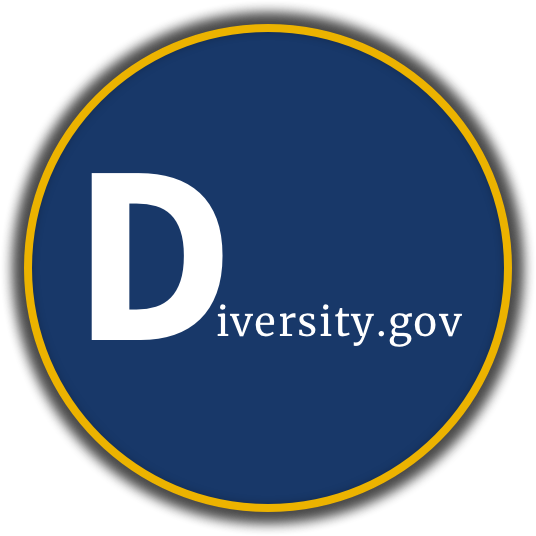

# General Assembly's WDI+ & UXDI Hackathon

__Team__: *We Diversity

__Members__: Ozge Ergen, Graham Fleming, Neo Jang, Aleena Madni, Alton Jenkins

Website is hosted here ([link](https://diversity-gov.herokuapp.com/))

## Problem Statement
People need an easy way to filter, visualize and consume workplace diversity analytics for state and local government.  

## Hypothesis
We believe that by creating a platform that presents complex government employee demographics in a simple and digestible manner,  we will help government job seekers who value diversity and inclusion make a more informed decision when applying for government employment.

Additionally, by making this data more consumable we anticipate more discussion and awareness about diversity and inclusion in the workplace.

## Persona
Kate Khan 
35
Lives in Austin,TX
Looking for a career change
She plans to get married and have a family. She cares about stability and diversity in workplace.
Project Manager with a graduate degree in Business Administration from UT.
She is looking for information on government institutions in Chicago, IL.

## Scenario
She is considering to move back to her hometown, Chicago. Diversity in the workplace is important for her. She is looking for a way to view workplace diversity analytics for the government institutions in Chicago.   
User Journey
She goes to www.diversity.gov. She filters to see the analytics for Chicago, then filters the data for the Position “Project Manager”.
